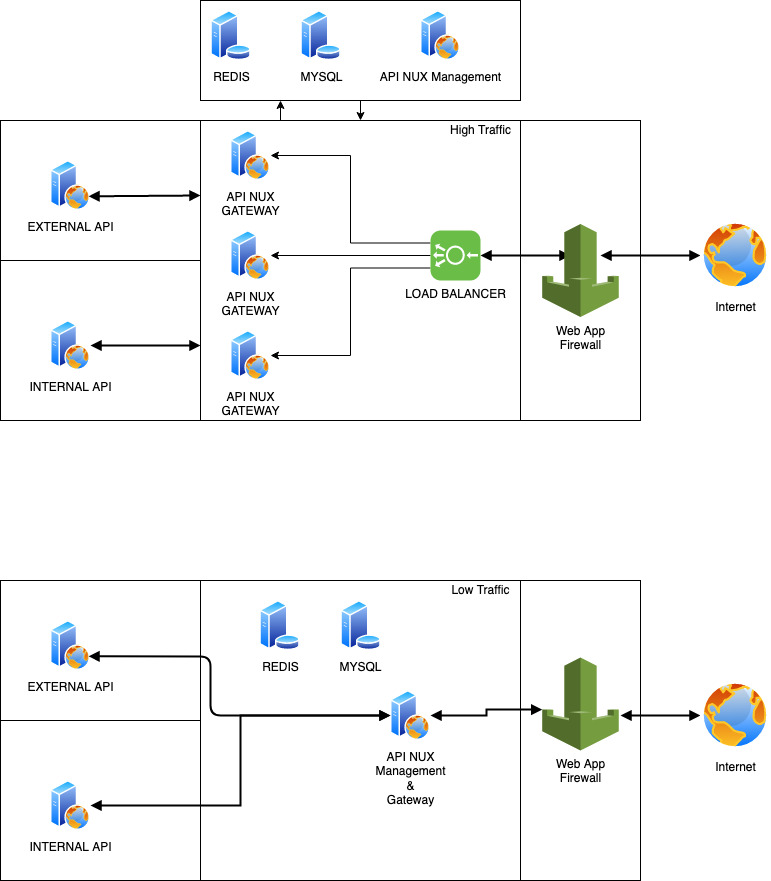

# PHP API GATEWAY

API Gateway only for load balancer

to manage API you need install API Management

# ENDPOINT

### production
`/1/user/add`

### Staging
`/sta/1/user/add`

### Developement
`/dev/1/user/add`

# TOPOLOGY

# Requirement

 - PHP 7 or above
 - PDO database
 - php-imap installed if using email login
 - php-swoole ext
 - Linux or Mac only
 - Docker Container

# INSTALATION

- Git Clone or download from Release
- install Composer
- run `composer install`
- copy **config.example.php** to **config.php**
- edit config.php based API management
- install swoole ext or use Dockerfile

### GNU Affero General Public License v3.0 
